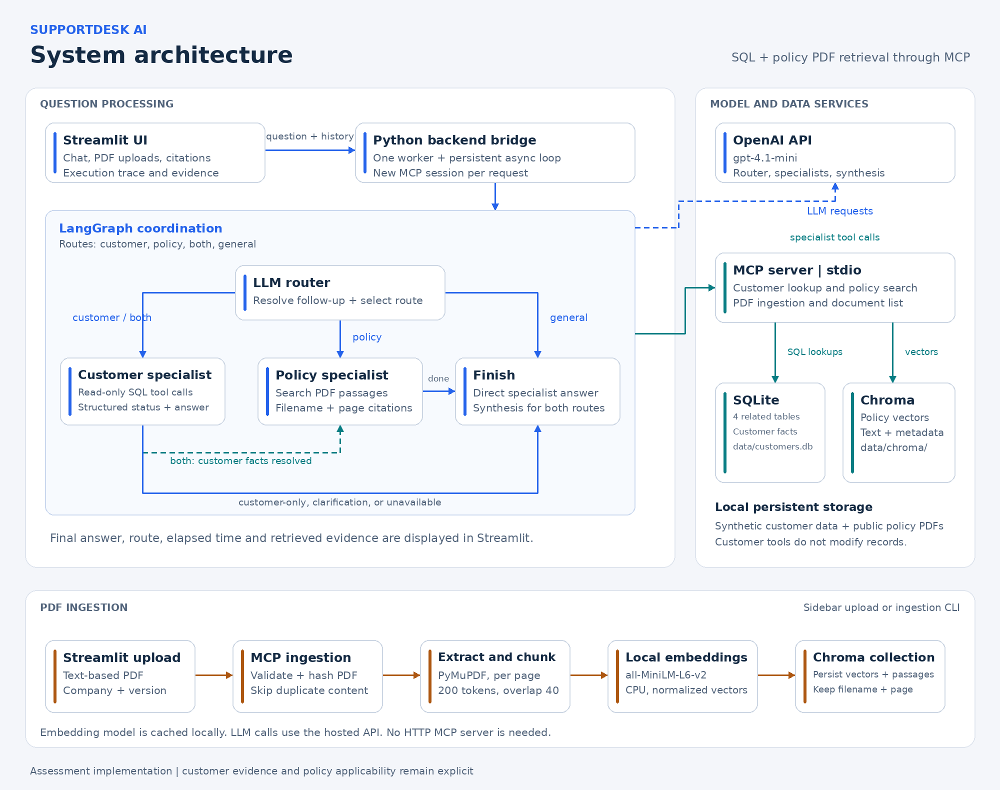

# SupportDesk AI

Generative AI Multi-Agent System | TCS Developer Assessment

**GitHub repository:** (https://github.com/wtfmadrid/TCS-Project)

**Demo video:** (https://drive.google.com/file/d/1cBbNbBnTZjI53ZxZ8TNO84vjjePScWzU/view?usp=sharing) 

## Overview

SupportDesk AI enables a customer support executive to investigate customer records and consult uploaded company policies through natural language. It combines structured customer information from SQLite with policy passages retrieved from a persistent Chroma vector database.

LangGraph coordinates a customer specialist and a policy specialist. An LLM router selects the required workflow, and MCP tools provide access to both data sources. Responses include relevant record IDs, policy page citations, and inspectable retrieval evidence. The application provides guidance and does not modify customer records or issue refunds.

## Assessment requirements

| Requirement | Implementation |
| --- | --- |
| Natural language access to structured customer data | Customer agent using MCP tools backed by parameterized SQLite queries |
| Searchable unstructured documents | PDF extraction, token-based chunking, local embeddings, and persistent Chroma storage |
| Generative AI multi-agent system | Customer and policy specialists coordinated by a LangGraph workflow |
| Accurate and context-aware responses | Evidence-grounded prompts, customer disambiguation, conversation history, and source citations |
| Synthetic customer dataset | Reproducible profiles, orders, tickets, and ticket conversations |
| Publicly available company policy | CompuSave Return Policy, June 2021 |
| SQL database and vector database | SQLite and Chroma |
| MCP server | Local MCP server using the stdio transport |
| User interface | Streamlit chat interface with PDF upload and indexing |
| Setup, architecture, and usage documentation | This README and the architecture image below |
| Demo video URL | Submission link at the top of this README |

## Architecture



### Query workflow

1. Streamlit passes the current question and successful conversation history to the backend.
2. The backend executes async work on one persistent event loop in a dedicated worker thread. Each request creates an MCP stdio session and loads its tools.
3. The router selects `customer`, `policy`, `both`, or `general` and rewrites follow-up questions into standalone requests.
4. Specialist agents retrieve evidence through MCP. The customer agent returns a structured status and answer.
5. The finish node returns a specialist answer directly or synthesizes both evidence sets. Streamlit displays the answer, route, elapsed time, execution trace, and retrieved evidence.

| Route | Execution |
| --- | --- |
| `customer` | Customer specialist, then finish |
| `policy` | Policy specialist, then finish |
| `both` | Customer specialist, then policy specialist, then synthesis |
| `general` | Scope and greeting response |

For the `both` route, unresolved customer identity or unavailable records stop the workflow before policy analysis. A new explicitly named customer takes precedence over the previous customer in conversation history. The customer result uses native structured output with `complete`, `needs_clarification`, or `unavailable` status. If its step budget is exhausted, the workflow preserves retrieved evidence and reports an incomplete investigation.

### MCP tools

| Tool | Purpose |
| --- | --- |
| `find_customer` | Find name or email matches and identify ambiguity |
| `get_customer_overview` | Retrieve profile information and order/ticket counts |
| `get_customer_orders` | Retrieve a customer's order history |
| `get_customer_tickets` | Retrieve all tickets or filter by ticket status |
| `get_ticket_details` | Retrieve a ticket, its linked order, and its conversation |
| `search_policy_documents` | Retrieve policy passages with filename and page metadata |
| `ingest_policy_pdf` | Extract, embed, and index an uploaded PDF |
| `list_policy_documents` | List indexed policy documents |

Customer tools are read-only. The LLM selects tools and arguments; it does not execute unrestricted generated SQL. MCP runs as a subprocess over stdio, so no separately managed HTTP service or Uvicorn process is required.

## Technology stack

| Component | Technology |
| --- | --- |
| Runtime | Python 3.10; implementation verified by the submitter on Python 3.10.1 and Windows |
| UI | Streamlit |
| Orchestration | LangGraph |
| Agent and model integration | LangChain, `langchain-openai`, and `langchain-mcp-adapters` |
| LLM | OpenAI `gpt-4.1-mini` |
| Structured database | SQLite through Python's `sqlite3` module |
| Vector database | Persistent Chroma |
| Embeddings | `sentence-transformers/all-MiniLM-L6-v2`, loaded through `langchain-huggingface` |
| PDF extraction | PyMuPDF |
| Chunking | LangChain recursive text splitter with the embedding model's tokenizer |
| Tool server | MCP Python SDK |
| Configuration | `python-dotenv` |

## Data and policy source

### Structured data

The database contains **four related tables in one SQLite database**, located at `data/customers.db`.

| Table | Records | Content |
| --- | ---: | --- |
| `customers` | 75 | Names, emails, account status, membership tier, and joining date |
| `orders` | 200 | Product, category, order/delivery dates, amount, currency, and status |
| `support_tickets` | 300 | Customer/order links, category, priority, description, status, and resolution |
| `ticket_messages` | 784 | Chronological customer and support messages |

The generator uses random seed `42` and a fixed snapshot date of **2026-10-01**. All customer records and conversations are synthetic. Monetary amounts are stored as integer cents in CAD. Foreign keys enforce relationships, including that an order linked to a ticket belongs to the same customer.

The dataset deliberately includes similar names, two customers named Alex Morgan, customers with no history, missing delivery dates, and multiple tickets concerning the same order. These cases exercise clarification and evidence handling.

### Policy source

- Document: **CompuSave Return Policy, June 2021**.
- Public source: [Return-Policy-June-2021.pdf](https://officeworks.ca/wp-content/uploads/2021/06/Return-Policy-June-2021.pdf).
- Suggested local filename: `policies/compusave_return_policy_2021.pdf`.

This document is a reference for the assessment, not a claim about the retailer's current policy. The synthetic database does not represent CompuSave's actual inventory or customers. For combined questions, retailer applicability must be established or explicitly assumed for a hypothetical comparison. The system should not automatically apply this policy to every fictional product.

### PDF retrieval pipeline

1. Accept a text-based PDF with company and version metadata.
2. Extract text page by page using PyMuPDF and preserve source page numbers.
3. Split text into approximately 200-token chunks with 40-token overlap.
4. Generate normalized embeddings locally with MiniLM on CPU.
5. Store vectors, text, and metadata in the Chroma collection `policy_chunks_minilm_v1` under `data/chroma`.
6. Embed each search query locally and retrieve passages by cosine similarity. The default retrieval returns up to six chunks.
7. Provide retrieved passages to the policy agent, which cites sources as `[filename, p. N]`.

SHA-256 document hashes prevent duplicate indexing of the same PDF. Uploads are limited to 10 MB, 100 pages, and 500 chunks. Empty-text pages are reported. Scanned documents require OCR outside this implementation.

## Repository layout

| Path | Responsibility |
| --- | --- |
| `ui.py` | Streamlit chat, policy uploads, document list, and evidence display |
| `app_backend.py` | Synchronous UI bridge, persistent async loop, and MCP sessions |
| `workflow.py` | Routing, specialist coordination, structured status, and answer synthesis |
| `customer_agent.py` | Customer specialist and its standalone CLI |
| `policy_agent.py` | Policy specialist and its standalone CLI |
| `mcp_server.py` | SQL and policy tools exposed through MCP |
| `database.py` | SQLite schema and read-only retrieval functions |
| `seed_db.py` | Deterministic synthetic data generation |
| `check_database.py` | Database integrity and curated data checks |
| `policy_store.py` | PDF ingestion, embeddings, Chroma storage, and retrieval |
| `chat.py` | Command-line interface for the coordinated workflow |
| `requirements.txt` | Dependency ranges |
| `requirements-lock.txt` | Exact installed dependency versions for reproducibility |
| `policies/` | Policy PDFs and uploaded document files |
| `data/` | Generated SQLite database, Chroma data, and local model cache |
| `docs/` | Architecture image and editable diagram |

## Setup

The commands below use Windows PowerShell and must run from the repository root.

### 1. Create and activate the environment

Install Python 3.10 and obtain the repository through GitHub or a downloaded archive.

```powershell
python --version
python -m venv .venv
.\.venv\Scripts\Activate.ps1
```

### 2. Install dependencies

Use the committed lock file to reproduce the working environment:

```powershell
python -m pip install -r requirements-lock.txt
```

`requirements.txt` records the dependency ranges; the lock file records the versions used for the submission. Python's `sqlite3` module is part of the standard library and does not require a separate database installation.

### 3. Configure the LLM

Create a `.env` file in the repository root:

```dotenv
OPENAI_API_KEY=your_api_key_here
OPENAI_MODEL=gpt-4.1-mini
```

Use an OpenAI API key with available API credit. LLM calls are paid API requests. Embeddings run locally and do not use a paid embedding API. Internet access is needed for LLM requests and the embedding model's initial download; subsequent embedding operations use the local cache.

### 4. Generate and check the database

```powershell
python seed_db.py
python check_database.py
```

Seeding keeps an existing populated database. For a deliberate rebuild, stop the application first and run `python seed_db.py --reset`. The reset process backs up the existing database before replacing it.

### 5. Obtain the reference policy

Download the linked public PDF manually, or use:

```powershell
New-Item -ItemType Directory -Force policies | Out-Null
Invoke-WebRequest -Uri "https://officeworks.ca/wp-content/uploads/2021/06/Return-Policy-June-2021.pdf" -OutFile "policies\compusave_return_policy_2021.pdf"
```

### 6. Start the application and index the PDF

```powershell
python -m streamlit run ui.py
```

Open the local address printed by Streamlit, normally `http://localhost:8501`.

In the sidebar:

1. Choose the policy PDF.
2. Enter `CompuSave` as the company and `June 2021` as the policy version.
3. Select **Index PDF** and wait for the indexing result. The first run can take longer while MiniLM downloads.
4. Select **Show / refresh indexed policies** to confirm the document is available.

PDF uploads are saved under `policies/uploads/`. Indexed content persists across app restarts. Policy questions require an indexed document.

Optional CLI indexing:

```powershell
python policy_store.py ingest "policies\compusave_return_policy_2021.pdf" --company "CompuSave" --version "June 2021"
```

Run indexing and the Streamlit application separately to avoid concurrent writes to the local store. The coordinated CLI can also be launched with `python chat.py`.

## Usage

Enter a question in the chat box. Use a full name, email, or customer ID to identify a customer. If several records match, respond to the clarification with the selected email or ID. Follow-ups use successful conversation history; **Clear conversation** resets that context.

| Example question | Expected behavior |
| --- | --- |
| `Summarize Ema Wilson orders and support tickets` | Customer 1's orders and support history, with relevant IDs |
| `Summarize Alex Morgan orders and support tickets` | Clarification between customer IDs 9 and 10 |
| `Customer ID 9` after that clarification | Continue the original task for the selected customer |
| `What evidence is required for shipping damage?` | Retrieve policy passages and cite filename/page numbers |
| `Assuming the uploaded CompuSave policy applies to Ema Wilson's order 1001, review her damaged-item complaint and identify missing information.` | Retrieve customer and policy evidence, state the assumption, and provide a conditional assessment |
| `Show orders and tickets for customer ID 5` | Explain that the customer exists but has no order or ticket history |
| `Show customer ID 999` | Explain that the customer does not exist in the dataset |

Expand **Execution trace**, **Customer evidence**, and **Retrieved policy passages** to inspect how an answer was obtained. References to photos in ticket messages indicate reported evidence; the assistant has not inspected the photos.

## Validation

`python check_database.py` checks record counts, SQLite integrity, foreign keys, customer/order ownership, date consistency, and curated lookup cases. Application validation uses manual end-to-end questions for customer retrieval, policy retrieval, combined reasoning, ambiguous names, clarification follow-ups, and switching customers within a conversation.

Useful evidence checks include:

- Ema Wilson is customer 1, with three orders and four tickets.
- Tickets 101 and 107 concern the same order, 1001, and must not be counted as two damaged orders.
- Ticket 101 is an open damage/refund complaint; referenced photos and a pending review do not establish refund approval.
- Ticket 106 contains a missing delivery date, which must be described as unknown.
- A missing customer is different from an existing customer with no history.
- Policy citations must match passages actually retrieved from the indexed document.

These checks support the demonstration; they do not constitute a measured LLM accuracy benchmark.

## Design choices and tradeoffs

| Choice | Reason | Tradeoff |
| --- | --- | --- |
| SQLite instead of a managed database | Reproducible local setup with no database service credentials | Suitable for the assessment; a shared production service would need stronger concurrency and access controls |
| Four related tables in one database | Represent profiles, orders, tickets, and conversations without separate infrastructure | Single-product orders; no order line items or partial-refund calculations |
| Paid hosted LLM | Avoid model hosting, GPU requirements, and fine-tuning | API cost, external dependency, and network latency |
| Local MiniLM embeddings | Avoid embedding API charges and keep indexing local | Initial model download and CPU processing time |
| Vector RAG with Chroma | Meet the required vector database architecture and retrieve semantically relevant passages | Similarity retrieval can miss exceptions; no reranker or fixed relevance threshold is implemented |
| Page-aware token chunking | Keep source citations and fit the embedding model's input size | Conditions spanning chunks or pages may require multiple searches |
| MCP stdio transport | Provide a clear tool boundary with minimal local service setup | Each backend request starts a new MCP subprocess; embedding resources can reload between requests |
| Sequential customer and policy execution | Resolve identity and retrieve facts before policy analysis | Combined questions require more tool and model calls; one observed combined query took approximately 68 seconds, not a benchmark or guarantee |
| Persistent event loop and one backend worker | Keep async client resources on the same loop and serialize local operations | Backend requests queue rather than execute concurrently |
| Controlled read-only lookup tools | Use parameterized queries and constrain database access | Questions are limited to the provided tools rather than arbitrary SQL analytics |
| Fixed synthetic snapshot | Make generated records and relative-date reasoning reproducible | Results describe the snapshot rather than a live operational system |

## Scope and limitations

- The application is a local assessment implementation without production authentication, authorization, or tenant isolation.
- Policy documents share one searchable collection. Company and version metadata support interpretation; there is no per-customer policy access boundary.
- Only text-based PDFs are supported. OCR, image interpretation, and photo verification are outside scope.
- The policy agent relies on retrieved passages. Its prompts request targeted follow-up searches and disclosure of insufficient evidence, but do not guarantee retrieval completeness.
- Refund approval, record updates, outbound communication, and other operational actions are outside scope.
- The June 2021 policy is a historical reference. Current policy verification is outside the demonstration.
